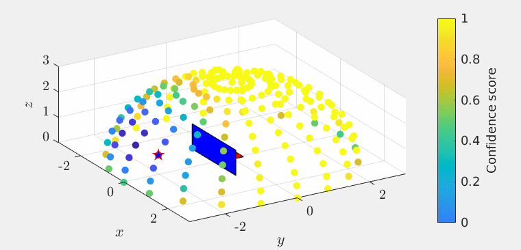

# Active_Object_Detection_IRaaS

## Overview
This repository implements the paper:

**"A Goal-Oriented Approach for Active Object Detection with Exploration-Exploitation Balance"**  
🔗 https://arxiv.org/abs/2509.11467  

The project introduces a novel framework for **active object detection**, enabling robots to intelligently balance:
- **Exploration** (searching new areas)
- **Exploitation** (focusing on likely target regions)

This balance improves detection efficiency in complex environments. The approach is validated through both **simulation** and **real-world experiments** using a UR5e robotic system.

---

## Key Features
- 🎯 Goal-oriented active object detection strategy  
- ⚖️ Balanced exploration–exploitation decision-making  
- 🧠 Measurement model integrating:
  - Detection confidence
  - Exploration potential  
- 🤖 Integration with real robotic hardware (UR5e + RealSense + YOLO)  
- 📊 Verified in both simulation and real-world scenarios  

---

## System Pipeline
The full pipeline integrates perception, decision-making, and control:

- RealSense camera → Images
- YOLO → Object detection
- Confidence bridge → Data fusion
- MATLAB → Decision-making (DCEE algorithm)
- UR5e → Motion execution

---

## Quick Start

Follow these steps to run the real-world experiment:

### 1️⃣ Launch RealSense Camera
```bash
ros2 launch realsense2_camera rs_pointcloud_launch.py
```

### 2️⃣ Launch UR5e Driver
```bash
ros2 launch ur_robot_driver ur_control.launch.py ur_type:=ur5e robot_ip:=158.125.190.88
```

### 3️⃣ Launch YOLO Detection Node
```bash
ros2 launch yolov5_ros2 yolov5_ros2
```

### 4️⃣ Launch Confidence Bridge Node
```bash
ros2 run confid_subpub confid_subpub
```

### 5️⃣ Run MATLAB Control Node
```matlab
DCEE_lego_s1_ros2_urscript_multi_run.m
```

📎 Full setup instructions:  
https://github.com/YaleiYU/UR5e-YOLO-Vision-Integration  

---

## Experiments

### Simulation
- LEGO brick detection in Isaac Sim environment  
- Demonstrates efficient exploration and detection  

### Real-World Experiment
- UR5e robot performs active search  
- Successfully detects targets in physical environment  

🎥 Demo Video:  
https://www.youtube.com/watch?v=FdFXst8uWxc  




---

## Requirements
- MATLAB R2024b  
- ROS2  
- Intel RealSense Camera  
- UR5e Robot  
- YOLOv5 ROS2 package  


---

## License
This project is licensed under the MIT License.  
See the `LICENSE` file for details.

---

## Acknowledgments
This work was supported by:

- UK EPSRC Established Career Fellowship  
  *“Goal-Oriented Control Systems: Disturbance, Uncertainty and Constraints”* (EP/T005734/1)

- EPSRC Project  
  *“Industrial Robots-as-a-Service (IRaaS)”* (EP/V050966/2)

Special thanks to the open-source community and contributors.

---

## Citation
If you use this work, please cite:

```bibtex
@misc{yu2025goal,
     author        = {Yu, Yalei and Coombes, Matthew and Chen, Wen-Hua and Sun, Cong and Flanagan, Myles and Jiang, Jingjing and Pashupathy, Pramod and Sotoodeh-Bahraini, Masoud and Kinnell, Peter and Lohse, Niels},
     title         = {{A Goal-Oriented Approach for Active Object Detection with Exploration-Exploitation Balance}},
     journal       = {arXiv preprint arXiv:2509.11467},
     year          = {2025},
     url           = {http://arxiv.org/abs/2509.11467}
}
```
